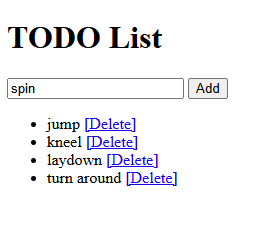

# Flask Demo

A simple TODO list web app built with Flask, Jinja2 templates, and SQLite.

## Features
- Add and delete tasks
- Server-side rendering with Jinja2 templates
- SQLite database via SQLAlchemy ORM
- Simple, readable code for interviews

## Tech stack
- Python 3.11+
- Flask
- SQLAlchemy (via Flask‑SQLAlchemy)
- SQLite


## Project layout
```text

flask_demo/
├── app.py
├── requirements.txt
└── templates/
└── index.html

```

## Setup
```bash
python -m venv .venv
# Windows (Git Bash or CMD)
source .venv/Scripts/activate
# macOS/Linux
# source .venv/bin/activate

# Install dependencies

pip install -r requirements.txt

# Run the app

flask --app app run

# Open http://127.0.0.1:5000

```

**How it works**

- Routing: @app.route("/") maps URL paths to view functions.

- Templates: render_template("index.html", tasks=...) passes data to Jinja2.

- Persistence: Task is a SQLAlchemy model. db.session.add() and db.session.commit() write to SQLite.

**Common commands**

Reset the database if you change the schema and are not using migrations:

```bash

rm -f todo.db  # Windows: del todo.db
flask --app app run

```

**Freeze dependencies after changes:**

```bash

pip freeze > requirements.txt

```

**Screenshot**




Next ideas

Add a JSON endpoint:

```python

@app.route("/api/tasks")
def api_tasks():
    return {"tasks": [{"id": t.id, "title": t.title} for t in Task.query.all()]}

```

**License**

MIT